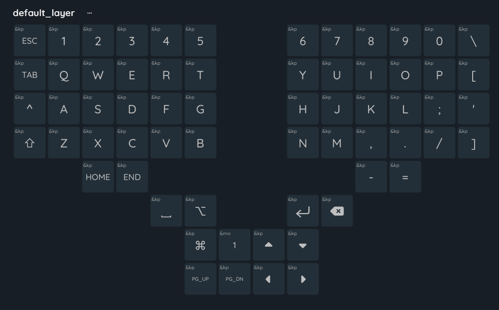
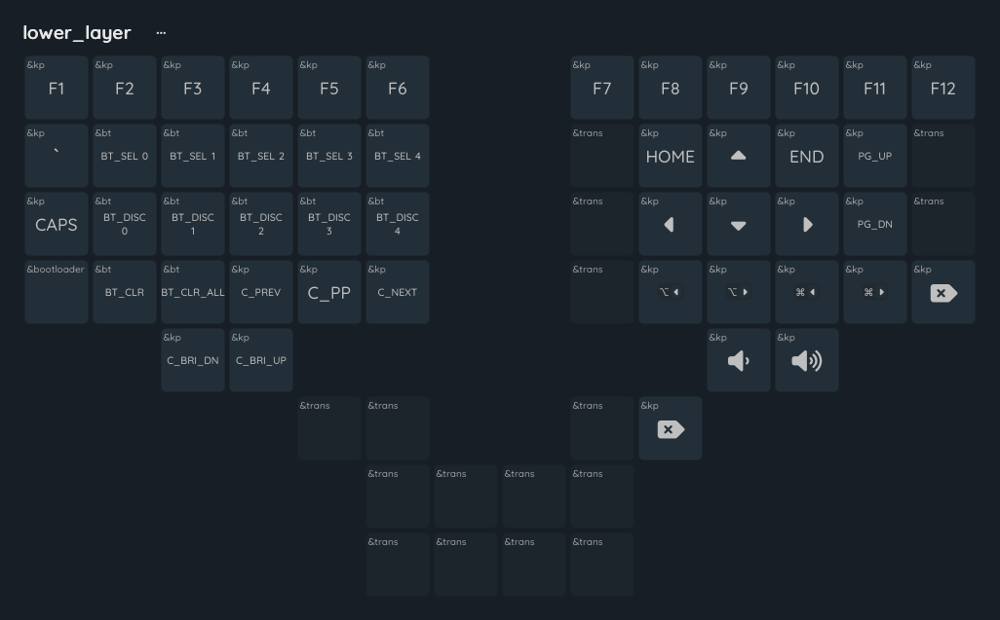

# "Mactyl" - Split Wireless Mechanical Keyboard

Firmware for my hand-wired Dactyl Manuform spit mechanical keyboard that I converted to wireless/bluetooth using Nice!Nano v2 boards.

Nicknamed "Mactyl" as it's a MacOS-layout Dactyl Manuform.

Keymap layout

